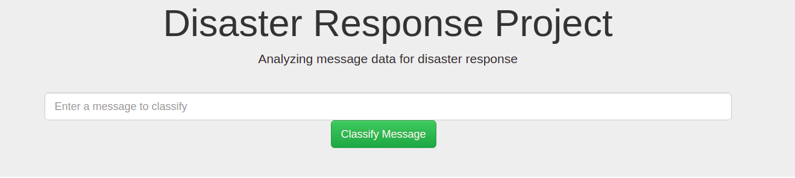
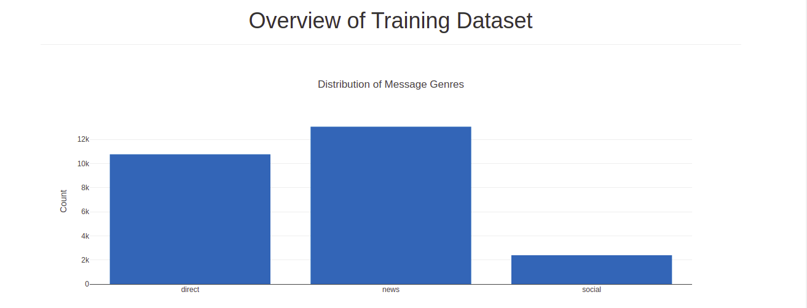
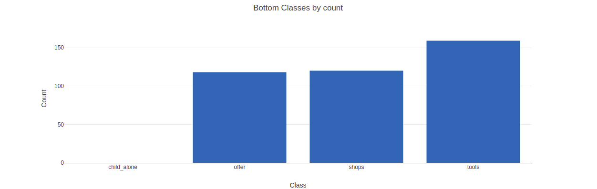
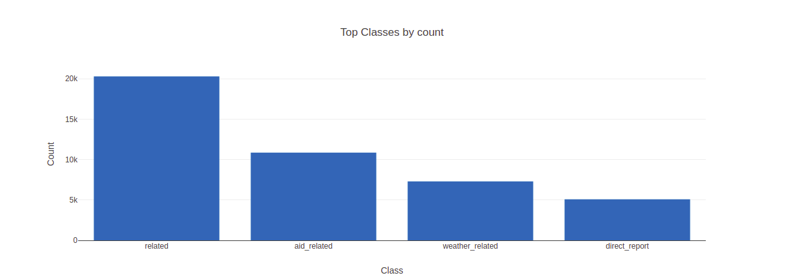
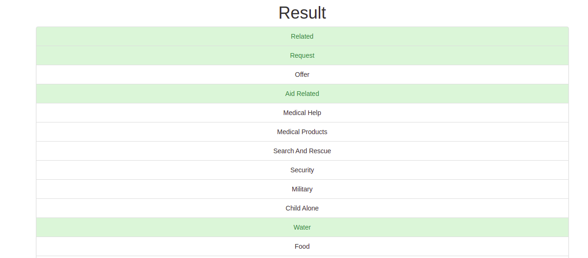

# Disaster Response Pipeline Project
A Flask Web app to classify texts from disaster response times into a 36 fixed set of categories.Dataset is used from Figure 8.Project is part of Udacity Data Scientist nanodegree program.In disaster time, this app will help categorize disaster messages so that you can send the messages to an appropriate disaster relief agency.
An emergency worker can input a new message in this web app and get classification results in several categories.The web app will also display visualizations of the data.

## Table of Contents

1. [Folders](#Folders)
2. [Dependecies](#Dependecies)
3. [Instructions](#Instructions)
4. [Web App Screen shots](#App)
5. [Metrics](#Metrics)

### Folders:
--&nbsp; app 
|    &nbsp; &nbsp;&nbsp;  -- templates 
|    &nbsp; &nbsp;&nbsp;&nbsp;&nbsp;&nbsp;&nbsp; -- master.html  # main page of web app 
|    &nbsp; &nbsp;&nbsp;&nbsp;&nbsp;&nbsp;&nbsp; -- go.html # classification result page of web app 
|-- run.py # Flask file that runs app 
|--data 
|    &nbsp; &nbsp;&nbsp;  -- disaster_categories.csv  # data to process 
|    &nbsp; &nbsp;&nbsp;  -- disaster_messages.csv  # data to process 
|    &nbsp; &nbsp;&nbsp;  -- process_data.py 
|    &nbsp; &nbsp;&nbsp;  -- DisasterResponse.db   # database to save clean data 
|--models 
|    &nbsp; &nbsp;&nbsp;  -- train_classifier.py  
|    &nbsp; &nbsp;&nbsp;  -- classifier.pkl  # saved model  
|    &nbsp; &nbsp;&nbsp;  -- X_test.csv  #test data set  
|    &nbsp; &nbsp;&nbsp;  -- Y_prediction.csv # predicted class  
|    &nbsp; &nbsp;&nbsp;  -- Y_test.csv # actual class  
|--screen_shots 
--&nbsp; README.md 
--&nbsp; Requirements.txt 

### Package Dependecies:
- nltk
- flask
- sqlalchemy
- sklearn
- joblib
- icecream
- pandas

### Instructions:
1. Run the following commands in the project's root directory to set up your database and model. 
> To run ETL pipeline that cleans data and store in database `python data/process_data.py data/disaster_messages.csv data/disaster_categories.csv data/DisasterResponse.db`  
>   To run ML pipeline that trains classifier and save  `python models/train_classifier.py data/DisasterResponse.db models/classifier.pkl`

    
2. Run the following command in the app's directory to run your web app.
    `python app/run.py`

3. Go to http://0.0.0.0:3001/

### Web App Screen shots:

Welcome screen

Charts 

 Classification results page 

### Metrics:
* Execution time: 48 minutes for classifier
* precision: 0.8868079851821362
* recall: 0.8376749611197511
* f1: 0.6628273389112246